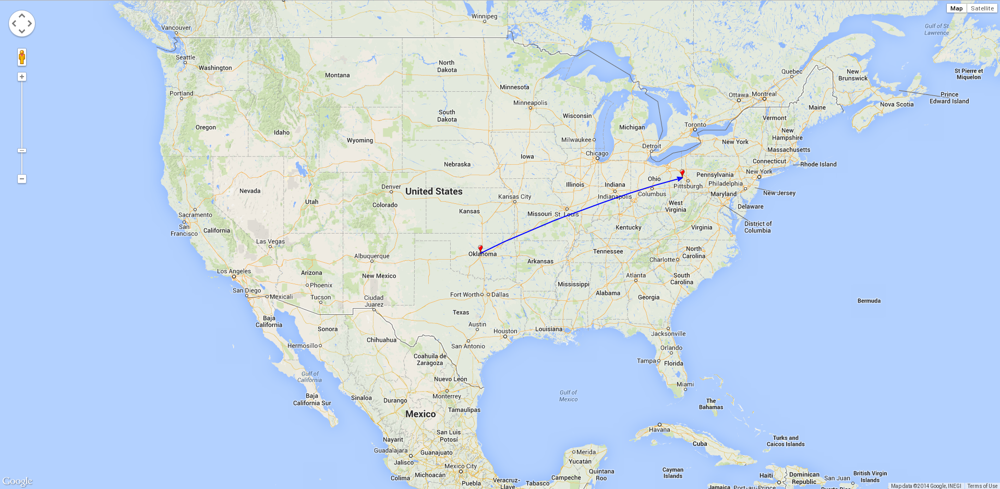

Twitter Tracker
=========

A program to capture GPS coordinates from tweets and plot them on a map.
 
#Usage
    python tracker.py -u <usernames> -t <hashtags>
 
* You can specify either scren names, or hashtags to watch
 
 

#### Dependencies
* python 2.7
* Users tweeting with location enabled

######Screenshot

